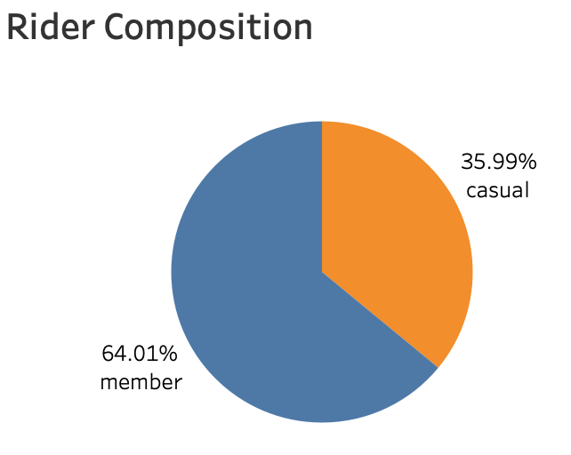
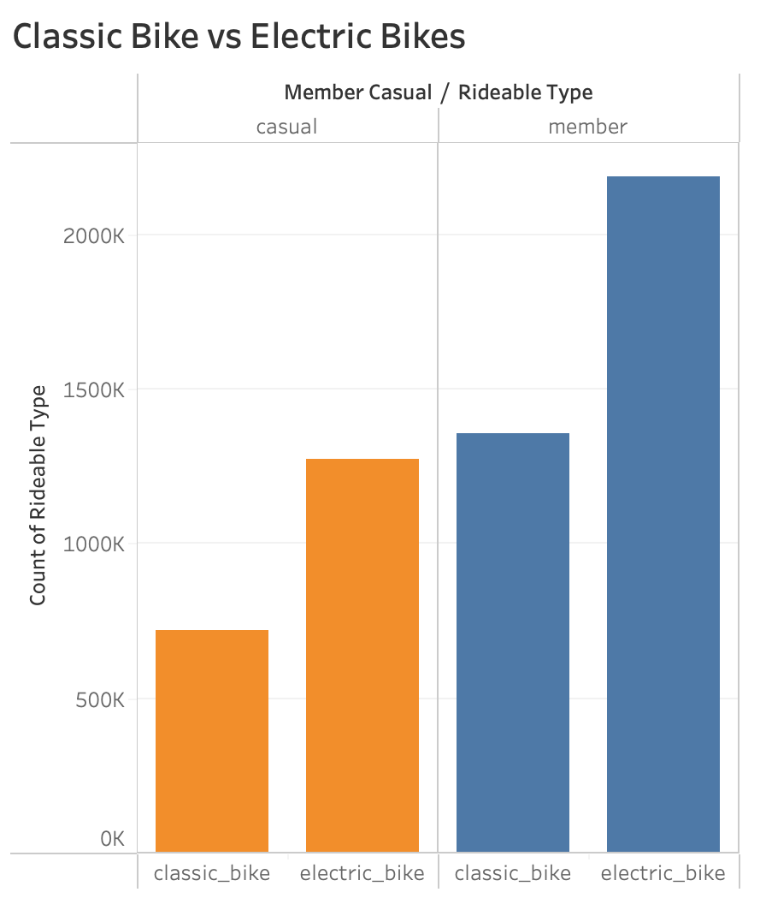
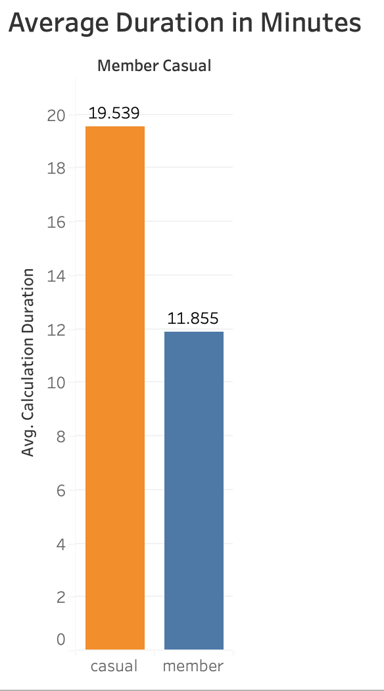
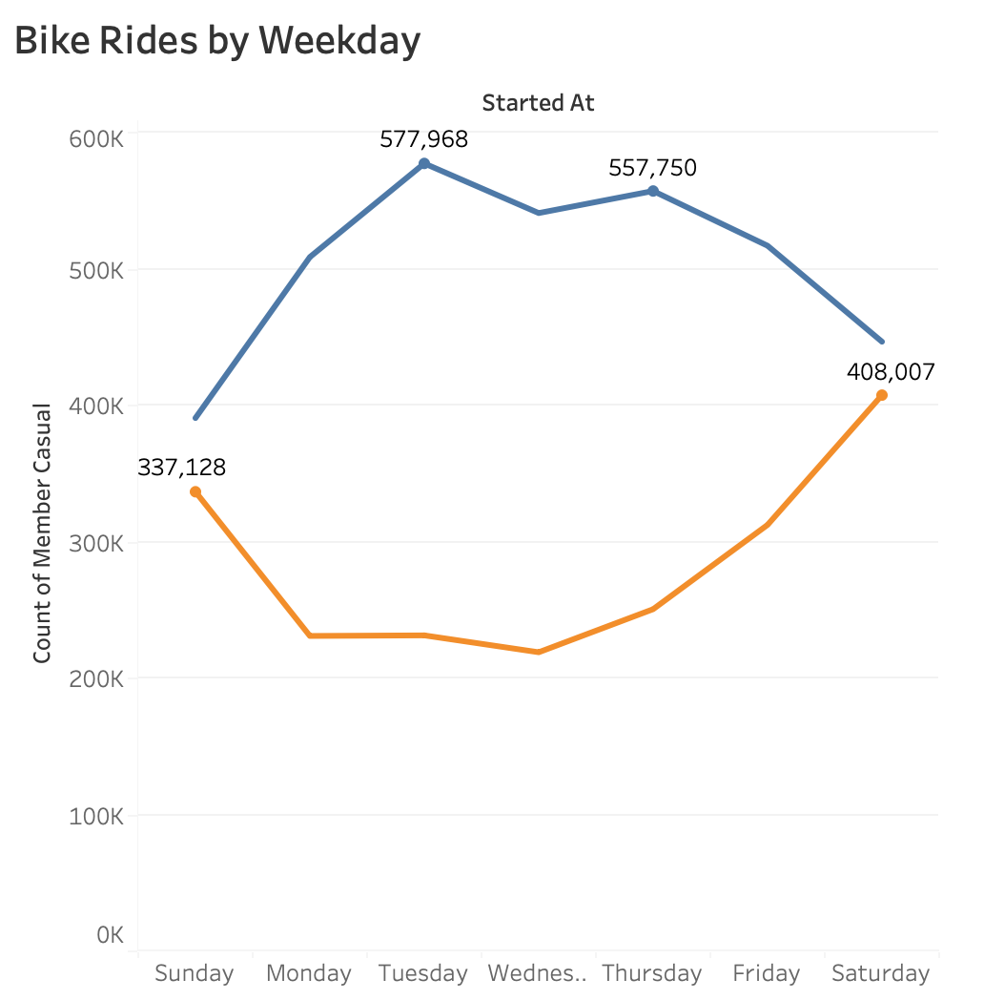
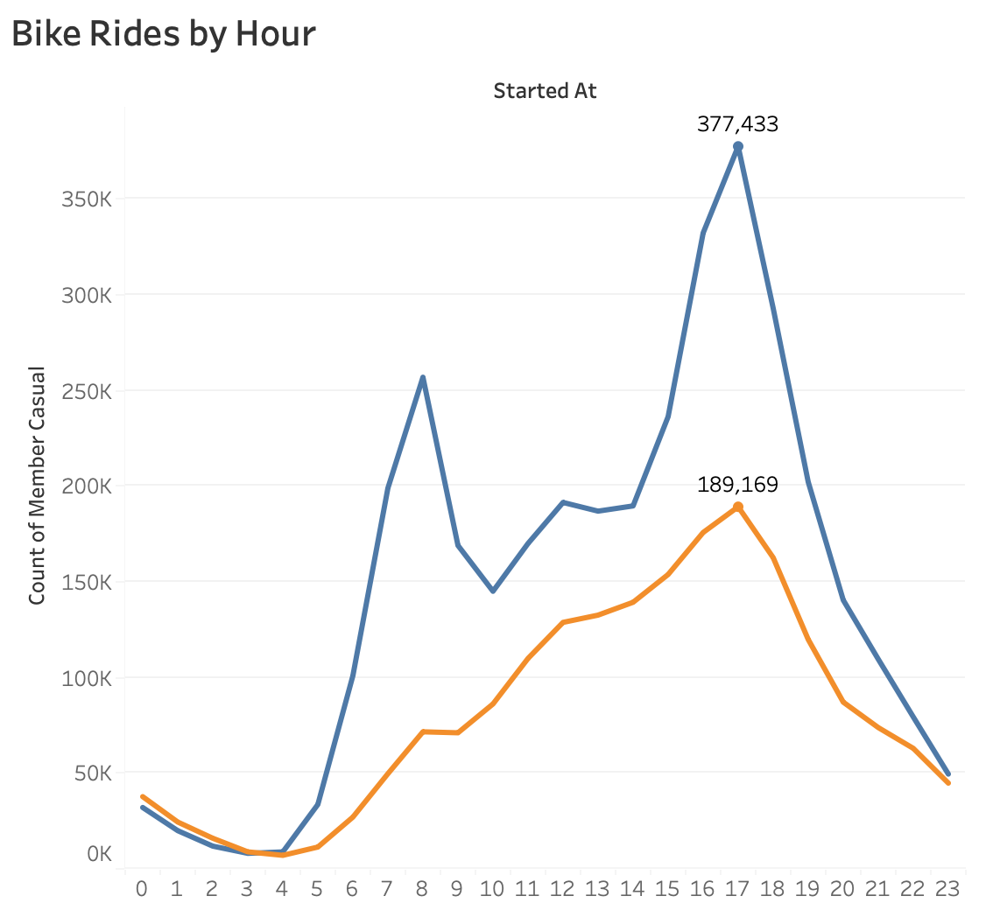
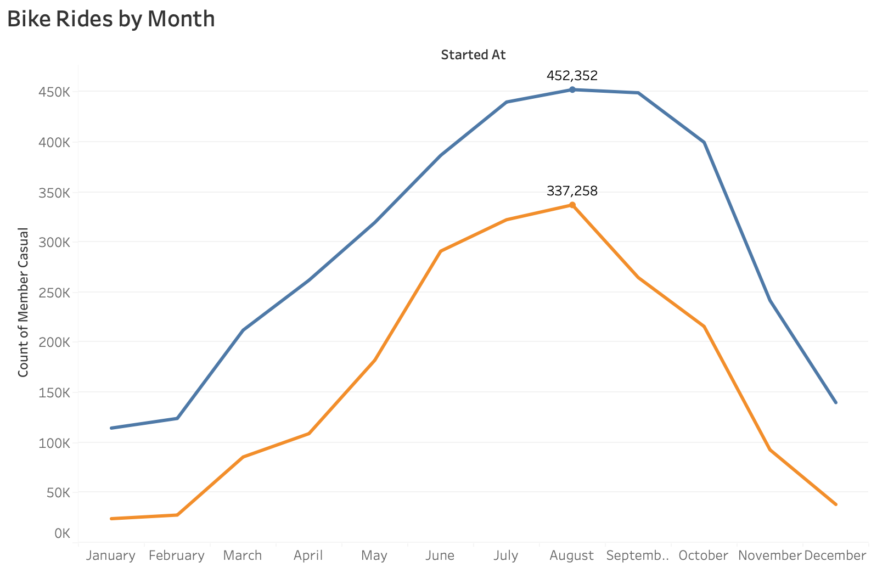

# Cyclistic Data Analysis Report
###### Last updated 10/29/2025
## Business Task

This analysis aims to analyse cyclistic bike-share data over the last 12 months to determine the differences between casual users and members. The goal is to find ways to convert casual users into members. Understanding the differences between the two groups will make it easier for the marketing team to appeal to casual members and encourage them to get annual memberships. Stakeholders for this analysis include the director of marketing and the executive team of Cyclistic.

## Data Sources Used for Analysis

This analysis uses bike-share data from October 2024 to September 2025. The data is stored across 12 .csv files with one file for each month of data. The data is from Motivate International Inc. and is credible and unbiased.

## Cleaning and Data Manipulation

The data from the 12 .csv files was imported into MySql for cleaning and exploratory data analysis. MySql was used because of the large size of the dataset which would have made spreadsheets less practical.

First, I created a new table to hold the bike-share data for the entire year. I then inserted information from the 12 tables that were imported into MySql.

I checked for duplicates and found none. Then I checked for NULL values and found none. Another thing I wanted to do was check the data types to make sure they were standardized. The `started_at` and `ended_at` col were TEXT types so I converted them to DATETIME.

I needed to add some new columns for the analysis. These were `ride_length` and `day_of_week`. To calculate `ride_length` I subtracted `started_at` from `ended_at`. I calculated days of the week with the WEEKDAY function. The days of the week are:

- 0=Monday
- 1=Tuesday
- 2=Wednesday
- 3=Thursday
- 4=Friday
- 5=Saturday
- 6=Sunday

For the `day_of_week` I converted the numerical results into strings for easier analysis.

## Analysis Summary

After cleanup and data manipulation the data was aggregated using MySql. The analysis showed both types of users have a preference for electric bikes over classic ones. I also found that casual members rode more frequently on weekends while members rode most frequently on weekdays. The average length of time for all rides was around 14 minutes. Members average time was 12 minutes while casual riders average time was 19 minutes suggesting casual riders like to ride for longer periods of time. I also analyzed the most frequent hours to detemine what times are most popular among casual and member groups. I found 4-6pm most popular among both groups. I also analyzed the most frequent months to see what seasons have the most activity among the riders. It was found that the summer months June-August were most popular among both groups.

## Visualizations and Key Findings

Tableau was used to create visualizations from the merged table created in MySql.

A key finding here was that most riders are members and only about a third are casual riders.

A major insight here is that electric bikes are prefered over classic bikes for both groups.

Another key finding was that casual riders tend to ride for longer than members at almost double the average time.

When making comparisons by weekday it seems that members tend to ride during the week while casual riders prefer riding on weekends. This suggest casual riders may be using the bikes for leisure or recreational purposes while members may be using bikes to commute to work.

Both casual riders and members prefer to ride their bikes in the evening hours between 4-6pm. Members are shown to also ride more in the morning hours compared to casuals.

Both members and casuals ride more in the summer months. The lowest number of riders was in the winter months.

## Top 3 Recommendations

Since casual riders prefer riding on weekends Cyclistc should make sure they have enough electric bikes during weekends in the evening hours as this is the busiest time for casuals.

To encourage casuals to switch to memberships the marketing team may want to create a recreational membership for riders who ride for at least 20 minutes on weekends since this would match casual members preferences.

Since riders tend to use bikes more in the summer, promotions or discounts of the membership package during this time might convert some casual riders to members.
